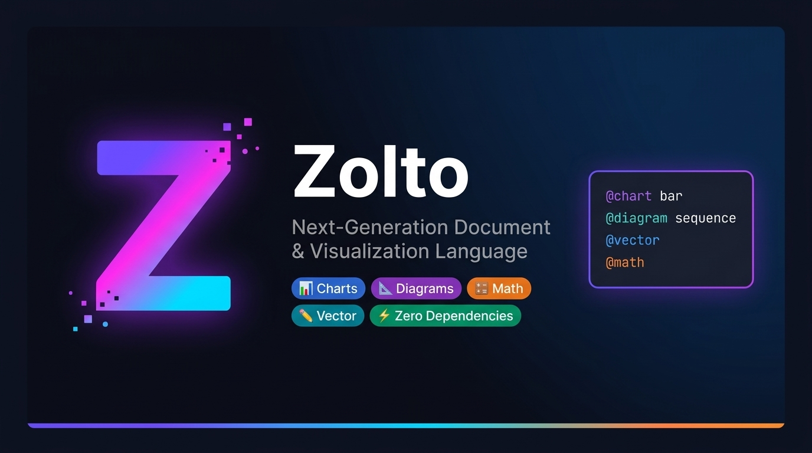

<div align="center">



# Zolto

### *The Next-Generation Document & Visualization Language*

A strict superset of standard Markdown with native Mathematics, Diagrams, Charts, Vector Graphics, Spatial Layouts, Components, and Interactive Runtime — built with **Zero Dependencies**.

[](https://github.com/uxle/zolto/actions/workflows/ci.yml)
[](package.json)
[](docs/development/roadmap.md)
[](tests/)
[](LICENSE)

</div>

---

## ⚡ Highlights

- **100% Markdown Compatible** — Every valid `.md` file is a valid `.zl` file. Zero syntax regressions across all 7 phases.
- **Zero Dependencies** — Self-contained math engine, diagram layout engine, statistical chart renderer, and vector drawing engine. No KaTeX, MathJax, Mermaid, D3, or Chart.js.
- **Phase 7 — Native Vector Engine** — Declarative vector drawing (`@vector`) with scene graph topology, artboards, layers, groups, symbols, shape primitives, Bezier curves, gradients, transforms, and accessible SVG output. Renders 5,000 shapes in under 500 ms.
- **Phase 6 — Native Chart Engine** — 24 native chart types (`bar`, `line`, `spline`, `radar`, `heatmap`, `candlestick`, `gauge`, `treemap`, etc.) with full negative-value support, zero-baseline axis rendering, statistical calculations, and multi-format data sources (inline, CSV, TSV, JSON, `$variables`).
- **Phase 5 — Native Diagram Engine** — 23 native diagram types (`flowchart`, `sequence`, `state`, `er`, `mindmap`, `tree`, `class`, `gantt`, `sankey`, `git`, etc.) with 9 pluggable graph layout algorithms, self-message arc rendering, and automatic sequence lifelines.
- **Phase 4 — Native Mathematics Engine** — Pandoc-style currency-safe `$expr$` inline math and `@math ... @/math` block math with auto-numbering, `@ref()` cross-references, and dual HTML + MathML accessibility.
- **Phase 3 — Native Block Directives** — Universal `@directive` syntax supporting 14 document component types (`@card`, `@tabs`, `@alert`, `@steps`, `@columns`, `@badge`, `@timeline`, `@progress`, `@avatar`, `@icon`, etc.).
- **Phase 2 — Extended Markdown** — Callouts (`> [!NOTE]`), admonitions (`[info]`), reference links, code headers, line numbers, and definition lists.
- **High Performance** — Parses and renders 10,000+ chart data points, 1,000+ diagram nodes, or 5,000+ vector shapes in under **500 ms**.
- **Security-First SVG** — All text and attribute content in diagram, chart, and vector SVG output is XML-escaped to prevent injection.

---

## 🚀 Quick Start

### 1. Run Zolto Studio (Browser Playground)

No build step required — launch the interactive live editor directly in your browser:

```bash
git clone https://github.com/uxle/zolto.git
cd zolto
npx serve . --port 3000
```

Open `http://localhost:3000` in your browser to start the live-preview editor.

### 2. Use the Engine (Node.js / ES Modules)

```javascript
import {
  compile,
  parse, render,
  parseDiagram, renderDiagram,
  parseChart, renderChart,
  parseVector, renderVector,
} from './src/zolto.js';

const source = `
# Quarterly Engineering Report

> [!NOTE]
> All systems operational across regions.

@chart bar title="Monthly API Volume"
source: csv
"month","requests"
"Jan, 2026", 12000
"Feb, 2026", 18500
"Mar, 2026", 24000
@/chart

@diagram sequence id="login-flow"
actor User
actor App
actor Server

User -> App: Enter credentials
App -> Server: POST /login
Server -> App: Bearer Token
App -> User: Authenticated
@/diagram

@vector width=480 height=160 theme="dark"
rect x=10 y=10 w=460 h=140 radius=10 fill="#1e2230"
circle cx=60 cy=80 r=32 fill="#7c5cff"
text x=108 y=72 size=18 weight=700 fill="#ffffff"
  Hello, Zolto Vector!
@endtext
@/vector
`;

const html = compile(source);
console.log(html); // → clean HTML with embedded accessible SVG
```

---

## 🎨 Feature Showcase

### 🖊️ Native Vector Engine (Phase 7)

```zolto
@vector width=600 height=300 theme="dark"
rect id="card" x=20 y=20 w=560 h=260 radius=12
  fill="#1e2230" stroke="#3d4466" strokeWidth=1
circle cx=80 cy=80 r=36 fill="#7c5cff" opacity=0.9
text x=140 y=72 size=22 weight=700 fill="#ffffff"
  Hello Zolto Vector
@endtext
text x=140 y=102 size=14 fill="#a0aec0"
  Scalable · Declarative · Accessible
@endtext
line x1=20 y1=140 x2=580 y2=140 stroke="#3d4466" strokeWidth=1
gradient id="gBlue" type="linear" x1=0 y1=0 x2=1 y2=0
  stop offset=0 color="#6ee7f7"
  stop offset=1 color="#7c5cff"
@endgradient
rect x=20 y=160 w=560 h=30 radius=6 fill="gradient:gBlue" opacity=0.5
@/vector
```

- **14 Shape Primitives**: `rect`, `circle`, `ellipse`, `line`, `polyline`, `polygon`, `path`, `arc`, `bezier`, `text`, `image`, `icon`, `group`, `use`.
- **Scene Graph**: `artboard`, `layer`, `group`, `frame`, `symbol`, `clipPath`, `mask`.
- **Styling**: HEX, RGB, RGBA, HSL, named colors, theme tokens (`$accent`, `$surface`), linear & radial gradients, opacity, dash patterns, filters.
- **Transforms**: `translate`, `rotate`, `scale`, `skew`, `matrix` — composable on any node.
- **Accessibility**: Every `@vector` block emits `role="img"` and `aria-label` on the root `<svg>`.

---

### 📊 Native Charts Engine (Phase 6)

```zolto
@chart spline title="Revenue Growth" theme="dark"
labels: Jan Feb Mar Apr May Jun
data: 120 180 240 310 420 580
@/chart
```

```zolto
@chart bar title="Profit & Loss (with negatives)" theme="light"
labels: Q1 Q2 Q3 Q4
data: 420 -80 310 560
@/chart
```

- **24 Chart Types**: `bar`, `hbar`, `line`, `area`, `spline`, `step`, `pie`, `donut`, `scatter`, `bubble`, `radar`, `polararea`, `histogram`, `boxplot`, `candlestick`, `heatmap`, `treemap`, `sunburst`, `funnel`, `waterfall`, `gauge`, `timeline`, `calendar`, `mixed`.
- **Negative Value Support**: Bar, hbar, line, area, spline, step, scatter, and bubble charts fully support negative values with automatic zero-baseline axis rendering.
- **Data Loaders**: Inline, CSV (with quoted comma handling), TSV, JSON, `$variable` bindings.
- **Statistics**: Built-in rolling average, standard deviation, mean, median, normalization.

---

### 📐 Native Diagram Engine (Phase 5)

```zolto
@diagram sequence title="Authentication Sequence"
actor User
actor App
actor Server

User -> App: Enter credentials
App -> Server: POST /login
Server -> Server: Validate & sign token
Server -> App: Bearer Token
App -> User: Authenticated
@/diagram
```

- **23 Diagram Types**: `flowchart`, `sequence`, `state`, `er`, `mindmap`, `tree`, `decision`, `org`, `class`, `object`, `package`, `component`, `deployment`, `usecase`, `activity`, `network`, `dependency`, `filesystem`, `git`, `timeline`, `gantt`, `sankey`, `journey`.
- **9 Layout Strategies**: `hierarchical`, `tree`, `circular`, `radial`, `force`, `grid`, `orthogonal`, `manual`, `sequence`.
- **Self-Messages**: Sequence diagrams support participant self-messages that render as rectangular arc loops.

---

### 🧮 Native Mathematics Engine (Phase 4)

```zolto
Inline math: $E = mc^2$

@math label="eq:lorentz"
E = \gamma m_0 c^2 \quad \text{where} \quad \gamma = \frac{1}{\sqrt{1-v^2/c^2}}
@/math

As shown in @ref(eq:lorentz), energy increases with velocity.
```

- **Currency-Safe**: `$10 or $20` stays plain text; `\$` escapes a literal dollar sign.
- **Dual Output**: Renders visible HTML and visually-hidden semantic MathML for screen readers.
- **Auto-Numbering**: `@math label="eq:id"` and `@ref(eq:id)` for cross-document references.

---

### 🧩 Native Block Directives (Phase 3)

```zolto
@tabs
  @tab label="Overview"
    @card title="System Status" variant="success"
      All services operational.
    @/card
  @/tab
  @tab label="Metrics"
    @progress value=85 @/progress
  @/tab
@/tabs
```

- **14 Built-in Components**: `@embed`, `@collapse`, `@tabs`, `@card`, `@steps`, `@columns`, `@badge`, `@tag`, `@alert`, `@timeline`, `@progress`, `@avatar`, `@icon`.

---

## 🗺️ Master Specification Roadmap (Phases 1 – 16)

See [`docs/development/roadmap.md`](docs/development/roadmap.md) and [`docs/P1 to p16/`](docs/P1%20to%20p16/) for complete technical specifications.

| Phase | Subsystem | Status | Key Deliverables |
| :--- | :--- | :---: | :--- |
| **Phase 1** | Markdown Core | ✅ | CommonMark & GFM foundation (headings, blockquotes, lists, tables, frontmatter, variables) |
| **Phase 2** | Extended Markdown | ✅ | Admonitions, GitHub callouts (`> [!NOTE]`), reference links, definition lists, figures |
| **Phase 3** | Native Block Directives | ✅ | Universal `@directive` syntax (cards, tabs, alerts, steps, columns, badge, timeline, progress) |
| **Phase 4** | Mathematics Engine | ✅ | LaTeX-style math (`$expr$`, `@math`), MathML, auto-numbering, `@ref()` cross-references |
| **Phase 5** | Native Diagram Engine | ✅ | `@diagram <type>` with 23 diagram types, 9 layout strategies, self-messages, themes, SVG |
| **Phase 6** | Native Chart Engine | ✅ | `@chart <type>` with 24 chart types, negative values, CSV/TSV/JSON, statistics, themes, SVG |
| **Phase 7** | Vector Graphics Engine | ✅ | `@vector` declarative drawing, scene graph, shapes, gradients, transforms, accessible SVG |
| **Phase 8** | Spatial Layout & Canvas | 📋 | `@layout`, `@grid`, `@flex`, `@canvas`, `@page`, multi-page print, responsive slide decks |
| **Phase 9** | Component & Macro System | 📋 | `@component`, `@slot`, `@template`, `@macro`, typed props, logic (`{#if}`, `{#each}`) |
| **Phase 10** | Interactive & Educational | 📋 | `@interactive`, `@form`, `@quiz`, `@flashcard`, `@poll`, inputs, auto-grading, binding |
| **Phase 11** | Animation & Presentation | 📋 | `@animate`, `@keyframes`, motion tokens, `@presentation`, `@slide`, speaker notes, reveals |
| **Phase 12** | Plugin API & Extensions | 📋 | `@plugin` manifest, extension hooks, custom directives, renderers, sandboxing, permissions |
| **Phase 13** | Language Server & Tooling | 📋 | Full LSP, autocomplete, hover, linter, formatter, refactorings, incremental parsing/rendering |
| **Phase 14** | Collaboration & Ecosystem | 📋 | Real-time collaboration, presence, versioning, branching, merging, review comments, publishing |
| **Phase 15** | Universal Theme System | 📋 | Design tokens, Light, Dark, and Eye Protection themes, runtime switching, theme packages |
| **Phase 16** | v1.0 Stable Release | 📋 | Feature & API freeze, formal specification, official CLI, security audit, starter templates |

---

## ⚙️ Public API Reference

```typescript
// ── Core Document API ──────────────────────────────────────────────────────
parse(src: string): { ast: DocumentNode, errors: Error[], warnings: Warning[], diagnostics: Diagnostics }
render(ast: DocumentNode, opts?: { xhtml?: boolean, footnoteSection?: boolean }): string
compile(src: string, opts?: RenderOptions): string

// ── Diagram Engine API ─────────────────────────────────────────────────────
parseDiagram(src: string, header?: string): { ast: DiagramNode, diagnostics: DiagramDiagnostics }
renderDiagram(ast: DiagramNode, opts?: object): string
validateDiagram(ast: DiagramNode): DiagramDiagnostics

// ── Chart Engine API ───────────────────────────────────────────────────────
parseChart(src: string, header?: string): { ast: ChartNode, diagnostics: ChartDiagnostics }
renderChart(ast: ChartNode, opts?: object): string
validateChart(ast: ChartNode): ChartDiagnostics

// ── Vector Engine API ──────────────────────────────────────────────────────
parseVector(src: string, header?: string): { ast: VectorNode, diagnostics: VectorDiagnostics }
renderVector(ast: VectorNode, opts?: object): string
validateVector(ast: VectorNode): VectorDiagnostics

// ── Constants ──────────────────────────────────────────────────────────────
VERSION: string   // '7.0.1'
PHASE: number     // 7
```

> **No-Throw Guarantee**: `parse`, `render`, `compile`, and all subsystem parse/render functions never throw. Errors and warnings are always returned through the `diagnostics` object or encoded as error nodes in the output HTML.

See [`docs/api/`](docs/api/) for detailed API documentation.

---

## 🧪 Testing & Verification

```bash
# Syntax check — all source and test files
npm run check

# Full test suite — 601 tests across all 7 completed phases
npm run test:node
```

**Current status: 601/601 tests passing · all green.**

---

## 📁 Project Structure

```
zolto/
├── src/                    # Core engine (ships as-is, no build step)
│   ├── zolto.js            # Public API facade
│   ├── lexer.js            # Block tokenizer
│   ├── parser.js           # AST builder
│   ├── renderer.js         # HTML renderer
│   ├── inline-parser.js    # Inline content parser
│   ├── math-parser.js      # Pratt parser for math expressions
│   ├── ast.js              # AST node factories
│   ├── validator.js        # Static document validator
│   ├── diagnostics.js      # Diagnostics collector
│   ├── diagram/            # Phase 5 — Diagram engine
│   ├── chart/              # Phase 6 — Chart engine
│   └── vector/             # Phase 7 — Vector engine
├── tests/                  # Test suite (601 tests)
├── examples/               # Sample .zl documents
├── docs/                   # Developer & user documentation
├── index.html              # Zolto Studio (browser live editor)
└── package.json
```

---

## 📄 License

Zolto is released under the [MIT License](LICENSE).
